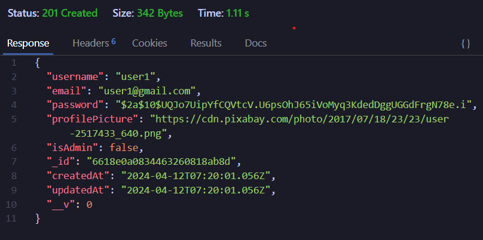
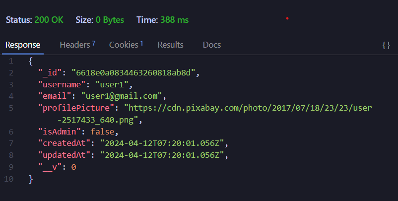
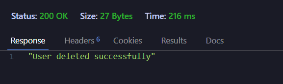
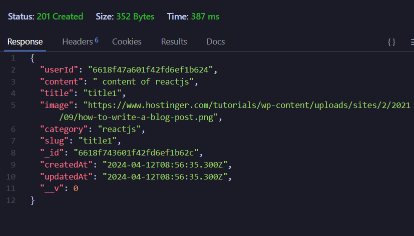
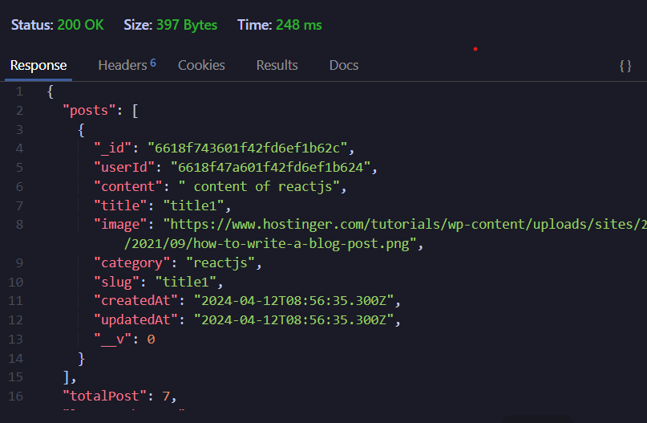

# 1) signup request :

```python
request : http://localhost:3000/api/auth/signup
req.body: {
 "username":"user1",
 "email":"user1@gmail.com",
 "password":"user1"
}
```



# 2) signin request :

```python
request : http://localhost:3000/api/auth/signup
req.body: {
 "email":"user1@gmail.com",
 "password":"user1"
}
```



# 3) Only Admin can delete other users :

```python
request : http://localhost:3000/api/user/delete/6618e0a0834463260818ab8d
```



# 4) Only Admin can create, edit and update post :

```python
request [POST] [Create Post] : http://localhost:3000/api/post/create
request [DELETE] [Delete Post] : http://localhost:3000/api/post/deletepost/:postId/:userId
request [PUT] [Update Post] : http://localhost:3000/api/post/updatepost/:postId/:userId

req.body = {

 "title":"title1",
 "category":"reactjs",
 "content":" content of reactjs"
}
```



# 5) Filtering or searching posts by tag, userId, title, category or content:

```python
request [GET] [Based on UserId] : http://localhost:3000/api/post/getposts?userId=6618f47a601f42fd6ef1b624
request [GET] [Based on category] : http://localhost:3000/api/post/getposts?category=your_category
request [GET] [Based on slug] : http://localhost:3000/api/post/getposts?slug=your_slug
request [GET] [Based on PostId] : http://localhost:3000/api/post/getposts?postId=your_post_id
```
